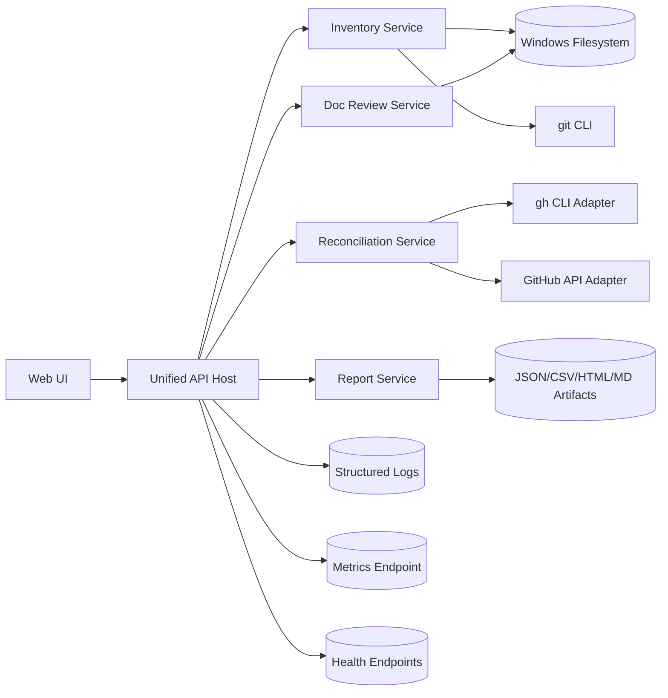
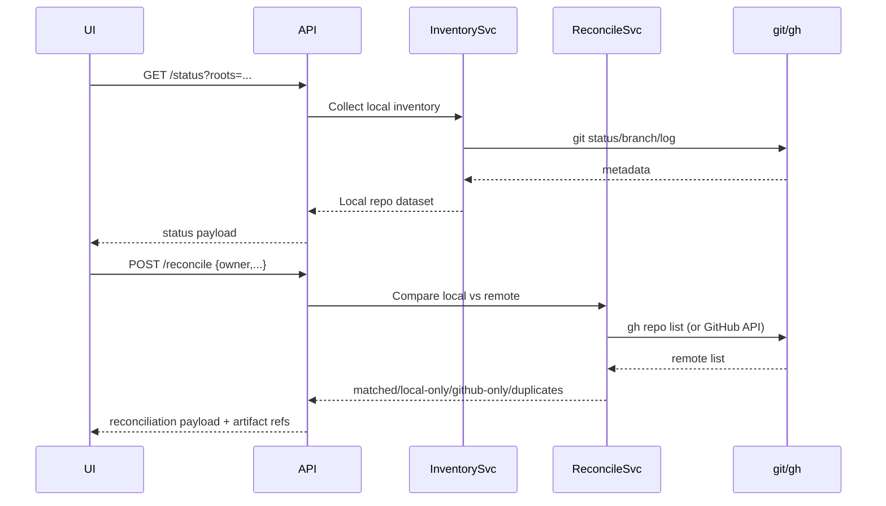

# Architecture and Design

## Executive Summary

This consolidation merges three separate tools into one Windows-first Repository Management Dashboard:

- `GitHubRepoManagerDashboard` (UI + API for local/git/GitHub repo status)
- `Doc_Review_Inventory` (PowerShell doc review planning pipeline)
- `Repo_reconciliation-dashboard` (PowerShell reconciliation/reporting utility)

Intent:

- unify operator workflows in one interface/API,
- preserve script-level reliability and machine-readable outputs,
- reduce duplicated scanning/reconciliation logic.

Non-goals:

- replacing GitHub itself for PR/permissions management,
- introducing distributed multi-node infrastructure,
- forcing a cloud dependency for home-lab execution.

Success criteria:

- one canonical API and output contract,
- parity for high-value workflows (scan, reconcile, queue plan, export),
- consistent logging/metrics/health behavior across modules,
- low-risk phased migration with rollback.

## Current State by Source Repository

### 1) `G:\Development\20_Staging\GitHubRepoManagerDashboard`

Purpose:

- operator dashboard for local repo status and optional GitHub insights.

Major features:

- local repo scan and git status (`/api/status`),
- repo actions (`/api/update`, `/api/sync`),
- settings API (`/api/settings`),
- optional GitHub metrics aggregation (`/api/github/status`),
- React grid, filters, grouping, summary cards, export helpers.

Key components:

- `backend/server.js` (Express API + git command execution + GitHub API integration),
- `services/apiClient.ts` (frontend API abstraction, mock/live modes),
- `components/*.tsx` (dashboard UI, table, actions, settings/init/data source modals).

Dependencies:

- Node runtime, Express, Octokit, git executable, browser runtime.

I/O:

- input: local filesystem paths, git repos, optional GitHub PAT.
- output: API JSON responses; client-side CSV/HTML export data URLs.

Known gaps/issues:

- `init/archive/export/artifacts` endpoints are mostly placeholders.
- frontend log panel expects SSE stream endpoints (`/api/streams/*`) not implemented in backend.
- logging is mostly unstructured `console.log`.
- backend stack diverges from intended PowerShell/.NET-first target.

### 2) `G:\Development\Doc_Review_Inventory`

Purpose:

- human-in-the-loop documentation review planning across many repos.

Major features:

- Stage 1 manifest generation (`Invoke-DocReviewInventory.ps1`),
- Stage 2a cross-repo queue planning (`Build-DocReviewQueue.ps1`),
- Stage 2b per-repo semantic batch planning (`Invoke-DocReviewBatchPlan.ps1`),
- packet/checklist/playbook generation for AI-assisted review.

Key components:

- `scripts/Invoke-DocReviewInventory.ps1`,
- `scripts/Build-DocReviewQueue.ps1`,
- `scripts/Invoke-DocReviewBatchPlan.ps1`,
- `config/repo-overrides.json`.

Dependencies:

- PowerShell, git (for freshness metadata), local filesystem.

I/O:

- input: repo roots/manifests/override rules.
- output: JSON/CSV/Markdown artifacts in `output/`.

Known gaps/issues:

- no API surface; script-oriented only.
- observability is console-centric and unstructured.
- generated outputs are large; lifecycle/retention policy not standardized.

### 3) `G:\Development\Repo_reconciliation-dashboard`

Purpose:

- inventory local folders/repos, compare against GitHub owner, detect duplicates, and export reports.

Major features:

- path traversal with include/exclude controls,
- git metadata + origin extraction,
- GitHub inventory via `gh repo list`,
- matching logic (OriginUrl/RepoName),
- duplicate detection with similarity/confidence scoring,
- exports: JSON, CSV, duplicate CSV, HTML report.

Key components:

- `src/repo_reconciliation_dashboard.ps1` (primary engine),
- `tests/repo_reconciliation.Tests.ps1` + support scripts,
- docs for preflight/error handling.

Dependencies:

- PowerShell, git, optional `gh`, Pester for tests.

I/O:

- input: local roots, owner/type, ignore patterns.
- output: reconciliation artifacts and execution logs.

Known gaps/issues:

- monolithic script structure; reuse boundaries not yet extracted.
- quadratic duplicate analysis may grow expensive at high repo counts.
- logging format differs from other tools.

## Feature Inventory and Overlap Matrix

| Capability | Dashboard Repo | Doc Review Repo | Reconciliation Repo | Disposition |
| --- | --- | --- | --- | --- |
| Local repo discovery | Yes (`/api/status`) | Indirect (docs scan by repo) | Yes (core) | Merge into shared scanner module |
| Git metadata (branch/status/last commit) | Yes | Partial | Yes | Merge with common schema |
| GitHub owner inventory | Yes (Octokit) | No | Yes (`gh`) | Keep both adapters behind one interface |
| Duplicate detection | No | No | Yes | Keep, expose via API |
| Documentation inventory/classification | No | Yes (core) | No | Keep, expose via API/jobs |
| Batch/queue planning for docs | No | Yes | No | Keep, integrate UI entrypoint |
| Repo actions (pull/fetch) | Yes | No | No | Keep, harden idempotency/retries |
| Export reporting | Partial/client-side | Yes (structured outputs) | Yes (structured outputs) | Merge under report service |
| UI dashboard | Yes | No | No | Keep and expand |
| Automated tests | Minimal frontend/backend | Limited | Strong Pester coverage | Standardize test pyramid |

Conflicts:

- Different runtime center of gravity (Node vs PowerShell scripts).
- Different GitHub access paths (Octokit API vs `gh` CLI).
- Inconsistent logging and health semantics.

Gaps:

- unified API contracts and versioned schemas,
- consistent error model,
- shared config/secrets pattern,
- centralized observability.

## Target Architecture

### Component Model

- `api-host` (PowerShell/.NET-first HTTP host)
  - routes requests to backend services,
  - exposes health and metrics endpoints.
- `inventory-service`
  - local filesystem scan + git metadata collection,
  - reusable by dashboard and reconciliation.
- `reconciliation-service`
  - GitHub inventory adapter (`gh` and/or API adapter),
  - match/local-only/github-only/duplicates generation.
- `doc-review-service`
  - Stage1/Stage2a/Stage2b orchestration,
  - manifest/queue/workitem generation.
- `report-service`
  - JSON/CSV/HTML/Markdown exports,
  - standard output naming and retention.
- `frontend`
  - dashboard views: Inventory, Reconciliation, Docs Review, Operations.

### Mermaid Architecture Diagram



ASCII fallback:

```text
[Web UI] -> [Unified API Host]
             |-> [Inventory Service] -> [Filesystem] + [git]
             |-> [Reconciliation Service] -> [gh adapter] / [GitHub API adapter]
             |-> [Doc Review Service] -> [Manifest/Queue/Batch Outputs]
             |-> [Report Service] -> [JSON/CSV/HTML/MD Artifacts]
             |-> [Logs] [Metrics] [Health]
```

### Data Flow (Status + Reconcile)



ASCII fallback:

```text
UI -> API -> InventorySvc -> git
UI <- API <- Inventory dataset

UI -> API -> ReconcileSvc -> gh/API
UI <- API <- Comparison + duplicates + artifacts
```

### Data Model and Storage

Canonical model groups:

- `RepoItem` (name/path/git status/branch/commit freshness/dirty counts).
- `RemoteRepoItem` (owner/name/url/archived/privacy/default branch).
- `ComparisonItem` (status, reason, local+remote fields).
- `DuplicateCandidate` (type, confidence, similarity score, path pairs).
- `DocManifestRepo` (doc counts, classes, quality hints, review mode).
- `QueueItem` and `BatchPlanItem` for doc-review planning.

Storage strategy:

- stateless runtime services where possible,
- persisted artifacts on disk under configured `outputRoot`,
- optional lightweight metadata cache for expensive GitHub metrics.

Configuration strategy:

- single config file for non-secret operational settings,
- environment variables for secrets/tokens,
- per-service sectioning (inventory/reconcile/doc-review/report/ui).

Secrets handling:

- no token persistence in client/browser storage,
- pass secret only to backend process memory scope,
- redact token material from logs.

## Error Handling and Resilience

Retry/backoff guidance:

- retry transient external operations only (GitHub API/`gh`, filesystem locks).
- exponential backoff with jitter for remote calls.
- cap attempts and surface partial results with clear warning state.

Idempotency guidance:

- `status`, `reconcile`, `doc-inventory`, `queue-plan`, `batch-plan` should be repeatable and side-effect safe.
- `pull`/`fetch` actions should track per-repo outcome and avoid global fail-fast.

Circuit-breaker guidance:

- if GitHub dependency repeatedly fails, degrade gracefully to local-only mode and annotate UI state.

Correctness after retries:

- include run correlation ID and attempt count in logs,
- validate output schema before writing artifacts,
- on partial failure, still emit machine-readable summary with failure list.

## Observability Design

### Structured Log Schema

Required fields:

| Field | Description |
| --- | --- |
| `timestamp` | ISO-8601 event time |
| `level` | `Debug`/`Info`/`Warn`/`Error` |
| `component` | service/module name |
| `operation` | operation ID (`status.scan`, `reconcile.run`, etc.) |
| `correlationId` | per-request/run ID |
| `message` | concise event message |
| `details` | object payload (counts, path, owner, error category) |

Write targets:

- console (interactive runs),
- rolling file (`logs/*.log`),
- optional ETW sink for Windows host diagnostics.

### Metrics

| Metric | Type | Description |
| --- | --- | --- |
| `repo_scan_runs_total` | counter | count of inventory scans started/completed |
| `repo_scan_duration_ms` | histogram | inventory duration distribution |
| `repo_items_discovered` | gauge | count of repos/folders found in latest run |
| `reconcile_runs_total` | counter | total reconciliation attempts |
| `reconcile_mismatch_items` | gauge | local-only + github-only count |
| `duplicate_candidates_total` | gauge | duplicate candidates per run |
| `doc_inventory_runs_total` | counter | Stage1 inventory runs |
| `doc_queue_items_total` | gauge | queue items generated in Stage2a |
| `doc_batch_count_total` | gauge | batches generated for Stage2b target repo |
| `operation_failures_total` | counter | failures by component/operation/error type |
| `api_requests_total` | counter | API request volume by route/status |
| `api_request_duration_ms` | histogram | route latency distribution |

### Health Checks and Semantics

- `GET /health/live`
  - success: process alive and request loop responsive.
- `GET /health/ready`
  - success: required dependencies usable (filesystem path access, git available, config loaded).
- `GET /health/dependencies`
  - detailed per dependency (git, gh, GitHub API, output path writable).

Semantics:

- `200`: request handled successfully,
- degraded or unready health states are reported in the response body `status` field,
- response body includes component statuses and failure reasons.

## Windows-Specific Considerations

- Runtime choice:
  - backend modules authored in PowerShell + .NET host for API/service boundaries.
- Scheduling options:
  - Windows Task Scheduler (recommended for home-lab periodic runs),
  - optional always-on service mode for continuous API availability.
- Filesystem:
  - normalize path handling (`\` separators, long path awareness),
  - protect against unauthorized folders and transient lock files.
- UAC/service vs scheduled task trade-off:
  - scheduled tasks are simpler and lower-privilege for batch scans,
  - service mode gives always-on API but needs tighter permission hardening.

## Technology Decisions and Trade-offs

Chosen direction:

- keep frontend as lightweight web UI,
- move orchestration and critical operations to PowerShell/.NET-first backend.

Trade-offs:

- retaining Node backend is fastest short-term but conflicts with long-term platform target.
- pure script execution is flexible but needs stronger module boundaries and schema contracts.
- dual GitHub adapters (`gh` + API) increase complexity but improve resilience and compatibility.

Alternatives considered:

- full rewrite into one .NET app immediately: rejected for migration risk.
- keep tools independent and integrate only via links: rejected due to duplicated logic/operations.

## UI/UX Alignment

Navigation/layout:

- top-level tabs: `Overview`, `Inventory`, `Reconciliation`, `Doc Review`, `Operations`, `Settings`.

Status/health surfaces:

- global banner for dependency degradation (e.g., GitHub unreachable),
- per-run status card with timestamps, counts, and artifact links.

Tables/forms:

- searchable, sortable tables with sticky headers,
- consistent filter chips and saved filter presets,
- explicit empty states with next action hints.

Pagination/filtering:

- client-side for small datasets,
- server-side pagination for large repo inventories.

Error states:

- actionable messages with error category and correlation ID,
- links to logs/artifacts for diagnostics.

## Testing and Quality Approach

PowerShell:

- keep/expand Pester suites for inventory, comparison, duplicate scoring, and output schema validation.

.NET/API host:

- unit tests for orchestration and contract mapping,
- integration tests for route -> service -> output behavior.

Frontend:

- component tests for grid filtering/grouping and operation states,
- API contract tests against sample payloads.

Static checks:

- PowerShell linting/formatting in CI,
- TypeScript linting/type checks in UI package.

Local dev workflow:

- run services independently first,
- run end-to-end smoke script covering status/reconcile/doc queue generation.

## Risks and Mitigations

| Risk | Impact | Mitigation |
| --- | --- | --- |
| Runtime mismatch across repos | medium | define canonical API + module interfaces first |
| Large workspace scan cost | medium | depth limits, ignore filters, incremental scan option |
| GitHub rate/permission limits | medium | cache, throttling, fallback adapters |
| Partial feature regressions | high | parity checklist + phased cutover + rollback |
| Output schema drift | high | schema versioning + contract tests |

## Inline ADR Log (Summary)

- ADR-001: Keep existing React UI; migrate backend to PowerShell/.NET module host.
- ADR-002: Preserve script-native artifact outputs as first-class interfaces.
- ADR-003: Support both GitHub adapters (`gh` and API) behind one abstraction.
- ADR-004: Observability baseline is required before full cutover.

See [Architecture Decisions](adr.md) for full ADR entries.

## TODO Placeholders

- TODO: confirm final API host project structure and route naming once scaffolding is added.
- TODO: define artifact retention policy (days/count/size cap) for `output/` and `logs/`.
- TODO: capture final auth model for GitHub PAT handling in UI->backend flow.

